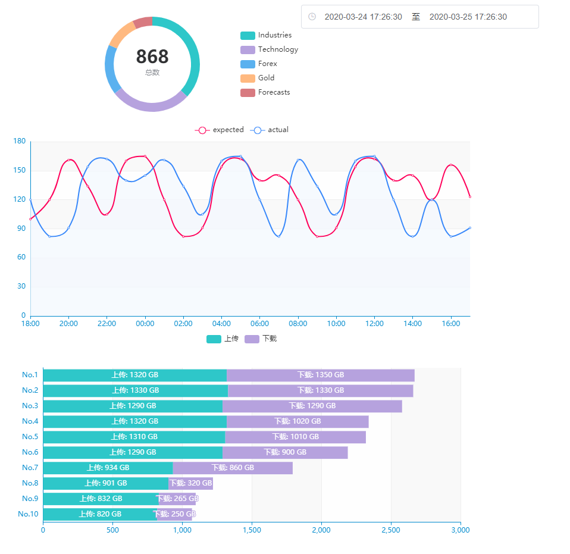
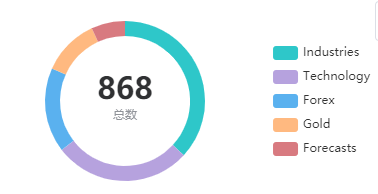
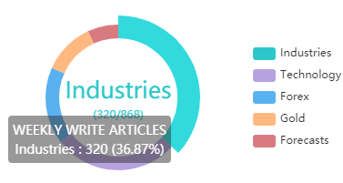
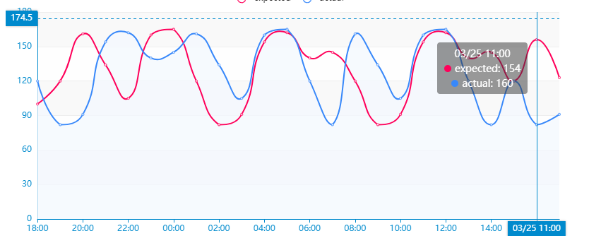
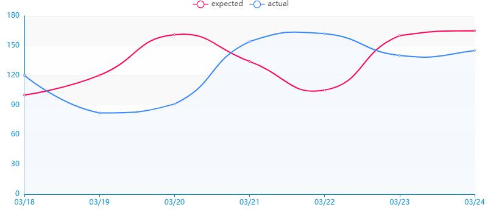
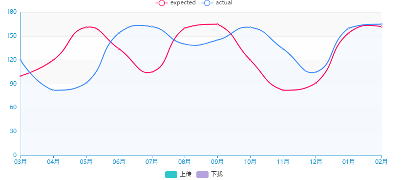
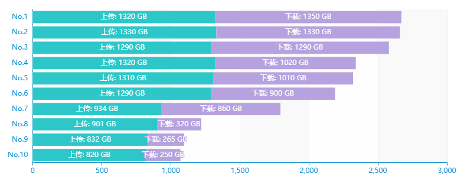

# dashboard

## Project setup
```
npm install
```

### Compiles and hot-reloads for development
```
npm run serve
```

### Compiles and minifies for production
```
npm run build
```

### Run your tests
```
npm run test
```

### Lints and fixes files
```
npm run lint
```

### Customize configuration
See [Configuration Reference](https://cli.vuejs.org/config/).

### 效果



### 插件

1. 图表使用 [echarts](https://www.echartsjs.com/zh/option.html#title)
2. 日期时间选择器使用 element-ui的
3. moment.js 处理日期格式

### 饼图

饼图需求: 当鼠标没有hover 在饼图的某一类时,展现总数,当hover到某一类时展现该项的具体数值.第二点好做,echart自带这个功能(setOption.series.label),主要是第一点,echart没有这个功能,所以投机取巧:joy:,我采用图表的setOption.title属性,同时设置层级.title层级zlevel为0,series层级zlevel为1,这样当鼠标hover的时候,label能够把title覆盖掉:smile: 





```javascript
this.chart.setOption({
    title: {
            zlevel: 0,
            text: [
              '{value|' + total + '}',
              '{name|总数}',
            ].join('\n'),
        ...
    },
    series: [
        {
              name: 'WEEKLY WRITE ARTICLES',
              type: 'pie',
              top: 'top',
              // roseType: 'radius',
              radius: ['65%', '80%'],
              zlevel: 1,
              data: data,
              label: {
                normal: {
                  show: false,
                  backgroundColor: '#fff',
                  position: 'center'
                },
         }
                ...
     ]

        ...
})
```

### 折线图

折线图需求要跟时间选择器联动,x轴并不是固定的,而且时间选择器要支持选择最近24H,最近一周,最近一月,最近一季度,最近一年的选项,默认选择最近24H,x轴分别要动态转换为 小时 天 月.

#### 小时(hour)



#### 天(day)



#### 月(month)



这个部分出过一个bug: 因为1个月的计算是按照30天为标准 取最近一年 导致减12次oneMonth 可能第一项的月份跟第二项月份相同 列如 ['3.1','3.31',.....], 换种理解就是 因为减的时间为 30天,导致循环执行到第12次时, 当前date[0] 依然比 start 起始日期要大,会执行循环的第13次,多出一个月,需要去除

```javascript
    getDate (type) {
      let base = +this.xData[1]
      let oneDay = 24*3600*1000
      let oneHour = 3600*1000
      let oneMonth = 3600*1000*24*30
      let date = []
      if (type === 'hour'){
        for (let i = 0; i < 24; i++) {
          if (i === 0){
            date.push(+new Date(base))
            continue
          }
          date.unshift(+new Date(base -= oneHour))
          // date.unshift(this.$moment(new Date(base -= oneHour)).format('DD HH:00' ))
        }
      }else if (type === 'day'){
        do {
          date.unshift(+new Date(base -= oneDay ))
        } while (date[0] > +this.xData[0])
      }else {
        do {
          date.unshift(+new Date(base -= oneMonth))
        } while (date[0] > +this.xData[0])
        if (new Date(date[0]).getMonth() === new Date(date[1]).getMonth()){
          date.shift()
        }
         // bug点: 因为1个月的计算是按照30天为标准 取最近一年 导致减12次oneMonth 可能第一项的月份跟第二项月份相同 列如 ['3.1','3.31',.....], 换种理解就是 因为减的时间为 30天,导致循环执行到第12次时, 当前date[0] 依然比 start 起始日期要大,会执行循环的第13次,多出一个月,需要去除
      }
      console.log(date);
      return date
    },
```

### 反转柱状图

用这个xy轴反转的柱状图主要是为了做一个类似于排行榜的效果,项目需求列出前10的信息,这个没啥好说的,直接看代码:joy:



